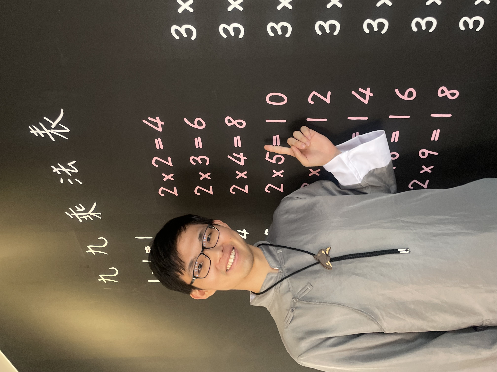

# Hajime Nakahashi 
### 中橋 一萌

::: {.columns}

::: {.column width="35%"}

{width=90%}

:::

::: {.column width="65%"}

Welcome to my personal webpage.

I am a PhD student in the Department of Mathematics at **National Taiwan University**.

I am a member of the
[Laboratory of Birational Geometry](https://sites.google.com/view/laboratoryofbirationalgeometry/%E9%A6%96%E9%A0%81),
supervised by Professor
[Jungkai Alfred Chen](https://www.math.ntu.edu.tw/~jkchen/).

**Email:** h0a5j9i [at] gmail.com

:::

:::

## Research Interests

My research interests lie in algebraic geometry, particularly **compact hyperkähler manifolds**, **moduli spaces**, and **derived categories**. I am especially interested in **Lagrangian fibrations**, **Fourier–Mukai transforms**, and the geometry of **singular fibers**.

## Selected Publications

Coming soon.

## Upcoming Events

<!------------------------------------------------------------------>

**Japanese-European Symposium on Symplectic Varieties and Moduli Spaces**

Sapporo, Hokkaido, Japan 
August 31 -- September 4, 2026  
<a href="https://sites.unimi.it/jes/"> Website</a>

<!------------------------------------------------------------------>

**Tübingen Summer School: Jacobians, Pryms and degenerations**

University of Tübingen, Tübingen, Germany 
September 15 -- 18, 2026  
<a href="https://sites.google.com/view/tuebingen26/home"> Website</a>

<!------------------------------------------------------------------>

**Research Visit to Sapienza University of Rome**

November 1, 2026 -- February 28, 2027  

Last updated: July 25, 2026

  <!-- 日付を変更 -->

  

